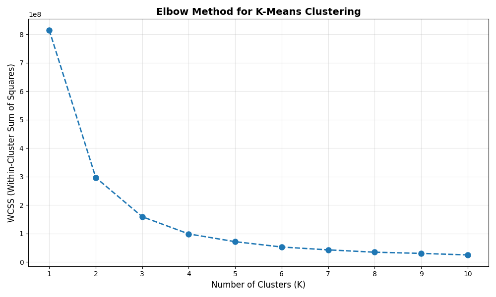
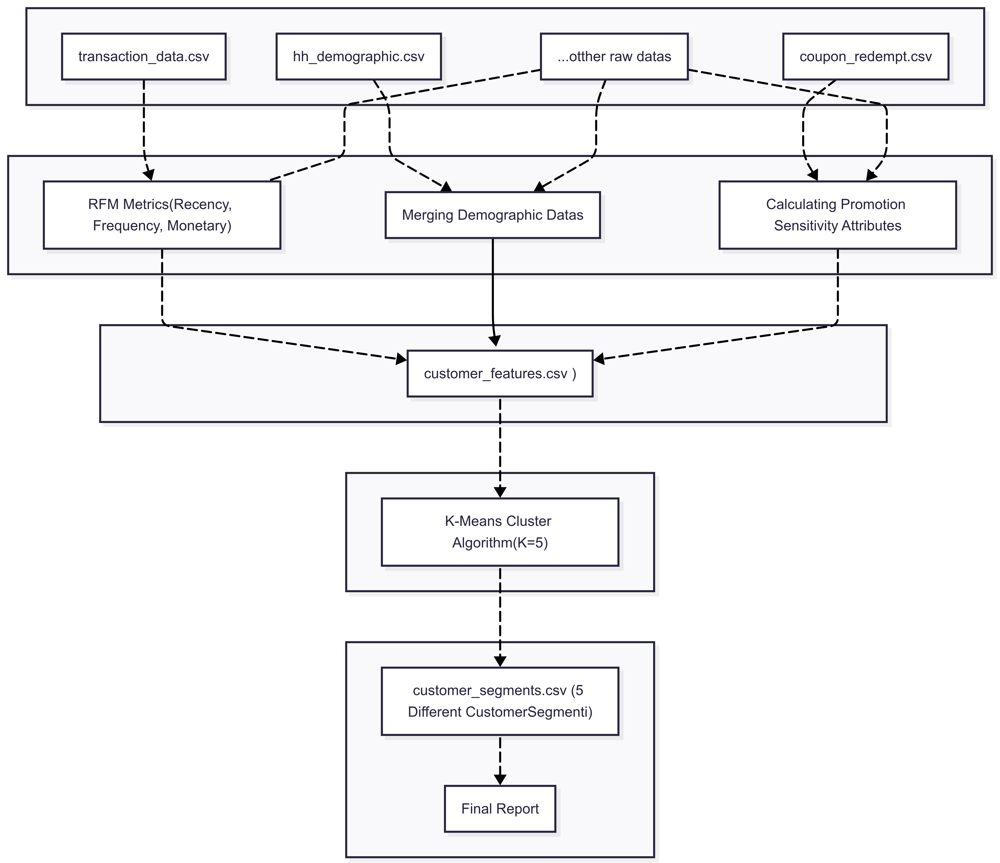

# Retail Marketing Analytics
An end-to-end data science project for customer segmentation and promotion sensitivity analysis.

This project merges transaction data, household demographics, and coupon/discount interactions to engineer RFM metrics and other behavioral features, builds a customer-level feature matrix, and performs K-Means clustering to generate actionable customer segments.

>   `docs/images/` :
> - `docs/images/pipeline.png` → the workflow diagram (attached pipeline figure)
> - `docs/images/elbow.png` → the Elbow method chart (attached plot)

---

## Table of Contents
- [Project Overview](#project-overview)
- [Data Sources](#data-sources)
- [Feature Engineering](#feature-engineering)
- [Modeling and Segmentation](#modeling-and-segmentation)
- [Project Flow](#project-flow)
- [Quick Start](#quick-start)
- [Expected Folder Structure](#expected-folder-structure)
- [Outputs](#outputs)
- [Interpreting Results (Example)](#interpreting-results-example)
- [Ideas for Improvement](#ideas-for-improvement)
- [License](#license)

---

## Project Overview
- Compute RFM metrics (Recency, Frequency, Monetary) and other behavioral/demographic features.
- Join demographics and campaign (coupon/discount) data.
- Produce a single customer-level feature set (`customer_features.csv`).
- Use the Elbow method to evaluate the number of clusters; run K-Means to segment customers.
- Save segment labels to `customer_segments.csv` and summarize for business use.

---

## Data Sources
Filenames/columns below are examples; adapt to your repo as needed.

- transaction_data.csv  
  Example columns: `household_id, transaction_id, date, product_id, quantity, sales_amount`
- hh_demographic.csv  
  Example columns: `household_id, age_band, income_band, region, marital_status, children_cnt`
- coupon_redempt.csv  
  Example columns: `household_id, coupon_id, issue_date, redeem_date, discount_amount`
- other raw data  
  Product, category, store, campaign, etc.

---

## Feature Engineering
- RFM metrics:
  - Recency: days since last purchase
  - Frequency: number of purchases in the period
  - Monetary: total spend in the period
- Promotion sensitivity (examples):
  - Coupon usage rate, share of discounted purchases, basket uplift during campaigns
- Demographic merge:
  - Age band, income band, family composition, region, etc.
- Additional behavioral signals:
  - Basket size, category breadth, purchase frequency, seasonality

Result: A per-customer, modeling-ready feature matrix: `customer_features.csv`.

---

## Modeling and Segmentation
- Use the Elbow method to assess the number of clusters (K).
- Cluster with K-Means (e.g., K=5).
- Summarize clusters with business metrics (RFM, promo sensitivity) and name them meaningfully.

Elbow chart:


---

## Project Flow
The diagram below illustrates the process from raw data to the final report:



---

## Quick Start

1) Environment setup
```bash
# Python 3.10+ recommended
python -m venv .venv
source .venv/bin/activate  # Windows: .venv\Scripts\activate
pip install -U pip

# If a requirements.txt exists:
pip install -r requirements.txt

# Otherwise, typical packages:
pip install pandas numpy scikit-learn matplotlib seaborn jupyter
```

2) Place data
- Put raw files under `data/raw/`:
  - `data/raw/transaction_data.csv`
  - `data/raw/hh_demographic.csv`
  - `data/raw/coupon_redempt.csv`
  - any others as needed

3) Feature building and segmentation
- Run notebooks or scripts in `src/`. Example Python flow:

```python
import pandas as pd
from sklearn.preprocessing import StandardScaler
from sklearn.cluster import KMeans

# 1) Load data
tx = pd.read_csv("data/raw/transaction_data.csv", parse_dates=["date"])
demo = pd.read_csv("data/raw/hh_demographic.csv")
cp = pd.read_csv("data/raw/coupon_redempt.csv", parse_dates=["issue_date","redeem_date"])

# 2) Simple RFM (illustrative)
today = tx["date"].max() + pd.Timedelta(days=1)
rfm = (tx.groupby("household_id")
         .agg(last_date=("date","max"),
              frequency=("transaction_id","nunique"),
              monetary=("sales_amount","sum"))
         .assign(recency=lambda d: (today - d["last_date"]).dt.days)
         .drop(columns=["last_date"])
         .reset_index())

# 3) Promotion indicators (illustrative)
promo = (cp.groupby("household_id")
           .agg(coupon_uses=("coupon_id","nunique"))
           .reset_index())

# 4) Merge
features = (rfm
            .merge(demo, on="household_id", how="left")
            .merge(promo, on="household_id", how="left")
            .fillna({"coupon_uses":0}))

features.to_csv("data/processed/customer_features.csv", index=False)

# 5) Scale + K-Means
num_cols = features.select_dtypes("number").columns.drop("household_id")
X = features[num_cols].fillna(0)
X_scaled = StandardScaler().fit_transform(X)

kmeans = KMeans(n_clusters=5, random_state=42, n_init="auto")
labels = kmeans.fit_predict(X_scaled)

segments = features[["household_id"]].assign(segment=labels)
segments.to_csv("data/processed/customer_segments.csv", index=False)
```

4) Reporting
- Visualize segment distributions, RFM summaries, and promo sensitivity and save to `reports/`.

---

## Expected Folder Structure
You can adapt this to your current layout.

```
.
├── data
│   ├── raw/
│   └── processed/
├── docs
│   └── images/
│       ├── pipeline.png
│       └── elbow.png
├── notebooks/
├── reports/
│   └── final_report.md
├── src/
│   ├── features/        # RFM, promo, demographic merging
│   ├── models/          # K-Means, evaluation
│   └── visualization/   # charts and plots
└── README.md
```

---

## Outputs
- `data/processed/customer_features.csv`  
  Customer-level feature matrix
- `data/processed/customer_segments.csv`  
  Segment labels (e.g., 0–4)
- `reports/final_report.md` or `.ipynb`  
  Segment summaries, visuals, and recommendations

---

## Interpreting Results (Example)
Segment names vary by business context; example labeling:

1) VIP & Loyal  
- Low Recency, high Frequency and Monetary; not heavily promotion-dependent

2) Loyal Deal-Seeker  
- High campaign sensitivity, frequent purchases, medium–high spend

3) Price Sensitive  
- Lower spend without discounts; high coupon usage rate

4) At Risk  
- High Recency (inactive for a while), low Frequency and Monetary

5) New/Exploring  
- Recently acquired; behavior not yet stable

For each segment consider:
- Messaging strategy
- Campaign/discount intensity
- CRM triggers (win-back, cross-sell, upsell)
- Insights (category mix, basket size, channel preferences)

---

## Ideas for Improvement
- Alternative clustering: Gaussian Mixture, HDBSCAN
- Automatic K selection: Silhouette, Calinski–Harabasz, Davies–Bouldin
- Time-series features: ARPU trend, churn propensity
- Basket analysis: Market Basket (Apriori/FP-Growth)
- Customer Lifetime Value (CLV) modeling
- Online scoring service (REST) and dashboard integration

---
